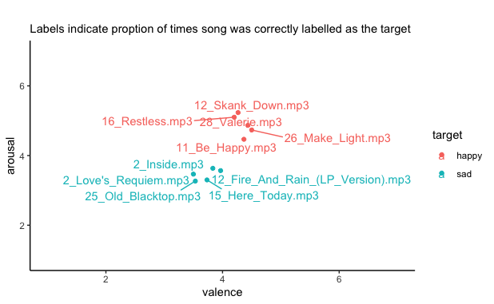

# Cross Modal Processing of Musical Emotions in Alexithymia

# Overview

# Songs to be used

Based off a pilot study we have selected 5 happy and 5 sad songs to use in the study. The songs were accurately labeled 40%-60% of the time and were represented well in 2D valence and arousal space

