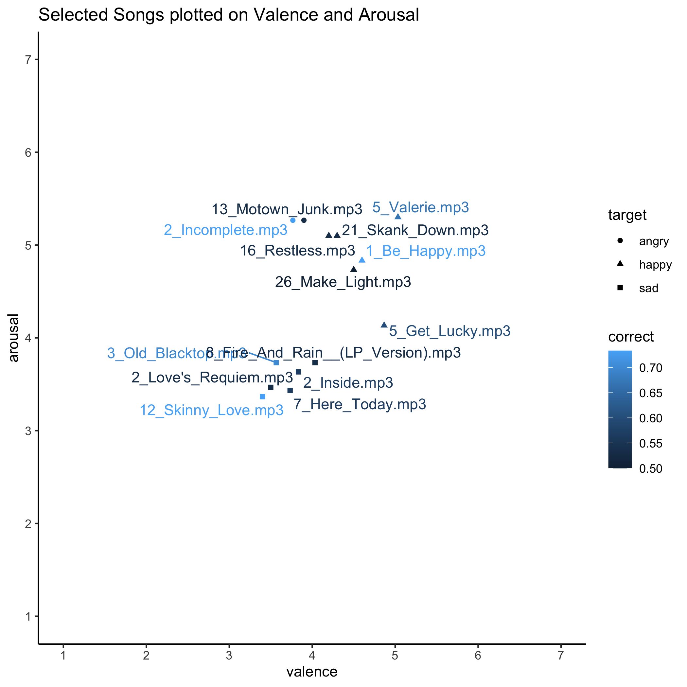

# Experiment Notes

Here we can see the plot of the songs selected and also a table describing them 

[And click here for a table version](selected_songs_tab.html) 

For the trials I want the middle 2 songs to be the target 

This means my cue happy songs are
- 21_Skank_Down.mp3
- 26_Make_Light.mp3
- 1_Be_Happy.mp3
- 5_Valerie.mp3

and my taret songs are 
- 5_Get_Lucky.mp3
- 16_Restless.mp3

My cue sad songs are 
- 2_Loves_Requiem.mp3
- 8_Fire_And_Rain__(LP_Version).mp3	
- 3_Old_Blacktop.mp3	
- 12_Skinny_Love.mp3	

and my target songs are 
- 7_Here_Today.mp3	
- 2_Inside.mp3	

and my angry taret songs are 
- 13_motown_Junk.mp3
- 2_Incomplete.mp3	

